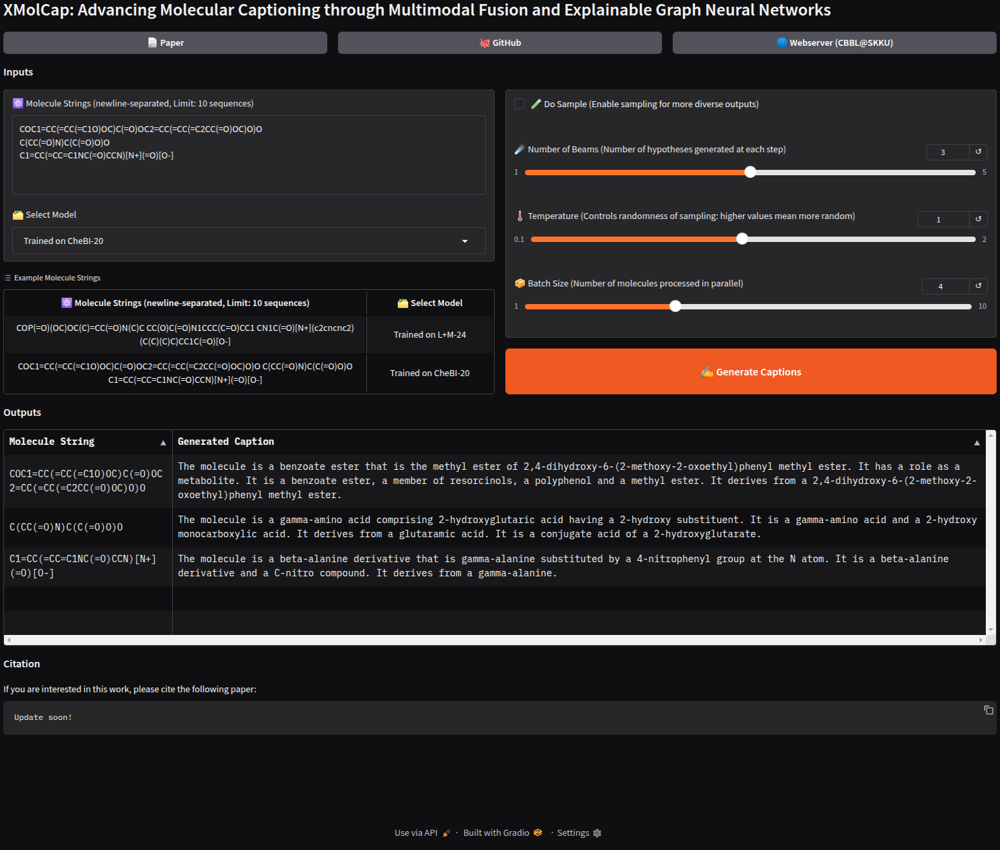

<h1 align="center">XMolCap</h1>
<p align="center"><a href="">📝 Paper</a> | <a href="#3-benchmark-datasets">🤗 Benchmark datasets</a> | <a href="https://1drv.ms/f/c/fa72f5f3c0e55162/EhdZirq68n5IpLsXZfioaJEBZCv7gJD0zqtQuG6RVL23rQ?e=hEx9lg">🚩 Checkpoints</a> | <a href="">🤗 Demo</a></p>

The official implementation of manuscript **"XMolCap: Advancing Molecular Captioning  through Multimodal Fusion and Explainable Graph Neural Networks"**

## Abstract
> Update soon!

## News
- `2024.12.03`: Manuscript was submitted to IEEE Journal of Biomedical and Health Informatics (IEEE JBHI)

## How to use

### 1. Environment preparation
Create an environment using Miniconda or Conda:
```zsh
conda create -n XMolCap python=3.10
conda activate XMolCap
```

After cloning the repo, run the following command to install required packages:
```zsh
# installing pytorch, recommend vervion 2.1.2 or above, you should change cuda version based on your GPU devices
pip install torch==2.1.2 torchvision==0.16.2 torchaudio==2.1.2 --index-url https://download.pytorch.org/whl/cu121

# installing additional packages
pip install -r requirements.txt

# install additional packages for Torch Geometric, cuda version should match with torch's cuda version
pip install pyg_lib torch_scatter torch_sparse torch_cluster torch_spline_conv -f https://data.pyg.org/whl/torch-2.1.2+cu121.html
```

### 2. Pretrained models
We use these pretrained models for fine-tuning:

- BioT5: [HuggingFace](https://huggingface.co/QizhiPei/biot5-base)
- SwinOCSR: [Kaggle](https://www.kaggle.com/datasets/gogogogo11/moedel)
- SciBERT: [HuggingFace](https://huggingface.co/allenai/scibert_scivocab_uncased)
- GIN-MoMu: [GitHub](https://github.com/ddz16/MoMu)

Except for BioT5 and SciBERT which are automatically downloaded when you start training or evaluating, you need to prepare SwinOCSR and GIN-MoMu's checkpoint from the above link, then put it into `weights/`.

### 3. Benchmark datasets
- LPM-24: [HuggingFace](https://huggingface.co/datasets/duongttr/LPM-24-extend)
- CheBI-20: [HuggingFace](https://huggingface.co/datasets/duongttr/chebi-20-new)

Because the datasets are automatically downloaded from HuggingFace, please send access request and login by following command:
```zsh
huggingface-cli login --token '<hf_token>'
```

### 3. Training model

#### LPM-24 dataset:

```zsh
python train.py --epochs 20 --batch_size 8 \
                --grad_accum 32 --warmup_ratio 0.05 --lr 3e-5 --num_devices 4 \
                --dataset_name lpm-24 --model_config src/configs/config_lpm24_train.yaml \ 
                --cuda
```

#### CheBI-20 dataset:
```zsh
python train.py --epochs 50 --batch_size 8 \
                --grad_accum 32 --warmup_ratio 0.04 --lr 1e-4 --num_devices 4 \
                --dataset_name chebi-20 --model_config src/configs/config_chebi20_train.yaml \ 
                --cuda
```

### 4. Evaluating model
#### Main checkpoints
| Checkpoints | Download link |
|---|---|
|LPM-24 (SMILES off, Center blocks) | [OneDrive](https://1drv.ms/u/c/fa72f5f3c0e55162/EQ69WtC5yCVIoD_5MvC-5WsBQjQ3JP5Y9UArGdkxIoYQog?e=nOHIKK) |
|CheBI-20 (All modals, Center blocks) | [OneDrive](https://1drv.ms/u/c/fa72f5f3c0e55162/EZVvB_qshgNHgA2L_yecyM4B5DRUOGwCkFZlWtRp0jOc5g?e=U0XVBb) |
#### Ablation studies' checkpoints
| Checkpoints | Download link |
|---|---|
|LPM-24 (Graph off, Center blocks)| [OneDrive](https://1drv.ms/u/c/fa72f5f3c0e55162/EcqTtyb_ROlGkm_AEeRnxoQB8nq-0ifmdHlOKGFZ59WkSQ?e=dsoUI9) |
|LPM-24 (Vison off, Center blocks)| [OneDrive](https://1drv.ms/u/c/fa72f5f3c0e55162/EcmEuIbEgytFl_x8iG92Q3cBzmGMlZCpPBOA3Unl_cRldQ?e=z5UFOw) |
|LPM-24 (All modals, First blocks)| [OneDrive](https://1drv.ms/u/c/fa72f5f3c0e55162/EW-oDiacHIFKlIhSpE-epe8Bp5T-4_r_9NdCUnr2YeF1ew?e=3YH6Yg) |
|LPM-24 (All modals, Center blocks)| [OneDrive](https://1drv.ms/u/c/fa72f5f3c0e55162/EXTkjXhk8wtGniPyZINgC7UBauqea127hr4fGs0Z73TD8Q?e=uLbiZg) |
|LPM-24 (All modals, Last blocks)| [OneDrive](https://1drv.ms/u/c/fa72f5f3c0e55162/EdLitFMoY3pKg7YZPbIyPNwB0HWTeKHG1i-4u2O0-EX4Ig?e=CfgxPX) |
|LPM-24 (All modals, Full blocks)| [OneDrive](https://1drv.ms/u/c/fa72f5f3c0e55162/ETJFHqC3wvtLt5Zanf51i_QByehGTAlzMPUTHzH7WfCfRw?e=Ys2UGM) |

#### Evaluate on LPM-24
```zsh
python eval.py --dataset_name lpm-24 \
               --model_config src/configs/config_lpm24_train.yaml \
               --checkpoint_path path/to/ckpt \
               --cuda
```

#### Evaluate on CheBI-20
```zsh
python eval.py --dataset_name chebi-20 \
               --model_config src/configs/config_chebi20_train.yaml \
               --checkpoint_path path/to/ckpt \
               --cuda
```

### 5. Application
#### Start the app
You can interact with the model through a user interface by running the following command:

```zsh
python app.py
```

The terminal will provide a local URL for testing and a public URL for global sharing.

### Preview


## Citation
If you are interested in my paper, please cite:
```
```